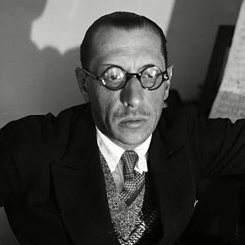
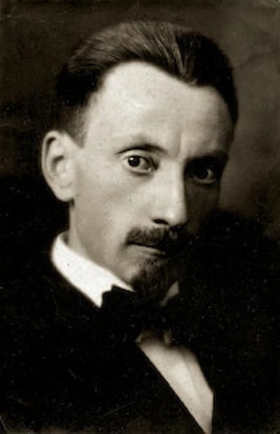
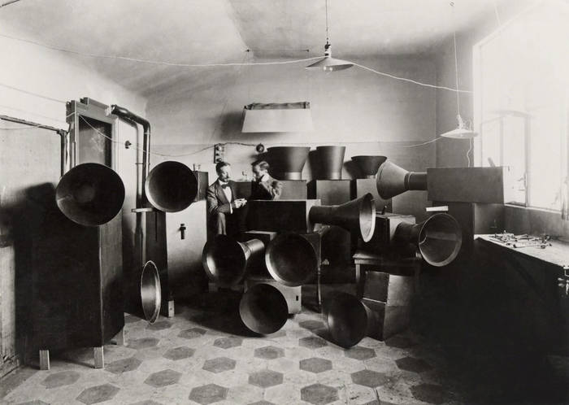
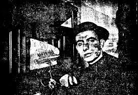

<!-- _paginate: false -->
# 1. Igor Stravinski (1882 – 1971)

Pianista, compositor y director de orquesta ruso, considerado uno de los músicos más influyentes del siglo XX.  

 

---
## 1.1 Biografía y Estilo
a) **Formación:** Hijo de un cantante de ópera, inició estudios de Derecho pero los cambió por la música, siendo alumno de Nikolái Rimski-Kórsakov.  

b) **Filosofía:** Se definía como un músico del "presente", rechazando etiquetas de pasado o futuro.  

c) **Frase célebre:** "La música es incapaz de expresar nada por sí misma" (de su obra teórica *Poetics of Music*).  

d) **Vida personal:** Casado dos veces (Yekaterina Nosenko y Vera de Bosset). Vivió en Rusia, Suiza, Francia y finalmente en EE. UU., donde se nacionalizó en 1945.  

---
## 1.2 Períodos Estilísticos

a) ***Período Primitivo o Ruso:***


- Influenciado por el folclore ruso y Rimski-Kórsakov.  

- Obras cumbre: *El pájaro de fuego* (1910), *Petrushka* (1911) y *La consagración de la primavera* (1913). *La consagración de la primavera* causó un escándalo histórico por su "salvaje disonancia polifónica" y ritmos abruptos.  

b) ***Período Neoclásico (1920 – 1950):***

- Retorno a formas de Mozart y Bach, oponiéndose al romanticismo.  

- Uso de instrumentos de viento, piano y coros.  

- **Obras:** *Pulcinella*, *Oedipus Rex*, *The Rake's Progress* (pináculo del período).  

---

c) ***Período Dodecafónico o Serialista (post-1951):***

- Adoptó la técnica de los doce tonos tras la muerte de Schoenberg.  

- **Obras:** *Agon* (ballet de transición), *Cánticum sacrum*, *Threni*.  

d) ***Período dodecafónico o serialista***

- **Permutación:** Quitar o agregar notas a un motivo sin importar la métrica.  

- **Ostinati:** Uso de repeticiones rítmicas extendidas que crean un "pastiche" musical similar al cubismo en la pintura.  

---
# 2. Luigi Russolo (1885 – 1947)


- Pintor futurista y compositor italiano, pionero de la música experimental.  

- **El Arte de los Ruidos (1913):** Manifiesto donde defiende el ruido como material musical.  

---
- **Intonarumori:** Inventó estas máquinas de ruido ("entonadores de ruidos") para sus conciertos.  

- **Obra destacada:** *Risveglio di una Città*.  

- Es considerado uno de los primeros filósofos de la música electrónica.  

---
# 3. Juan García Castillejo (1903 – 1985)


- Sacerdote e inventor español, precursor incomprendido de la música electrónica asistida por ordenador.  

- **Tratado:** *La telegrafía rápida*, *el triteclado* y *la música eléctrica* (1944).  
----

- ***El Electrocompositor Musical:*** Máquina programable con válvulas y osciladores capaz de crear secuencias automáticas. Permitía guardar composiciones mediante cintas perforadas (protolenguaje de programación).  

- **Legado:** Murió en el anonimato y la pobreza en Valencia; sus aparatos fueron vendidos como chatarra. Actualmente existe el *Premio Cura Castillejo* en su honor.  

## Diagrama

```mermaid
graph TD
    A[Música Electrònica] --> B[Luigi Russolo]
    A --> C[Juan García Castillejo]
    A --> D[Igor Stravinsky]


'''text
??? note "Més informació"
    Aquest contingut es pot desplegar.